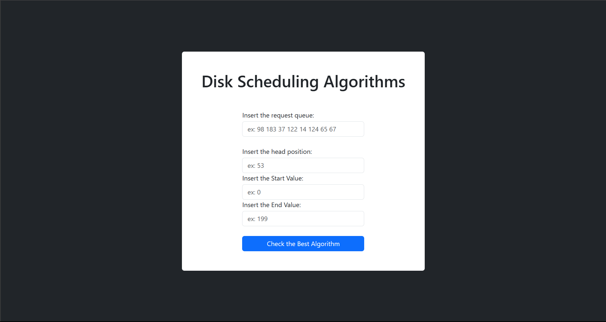
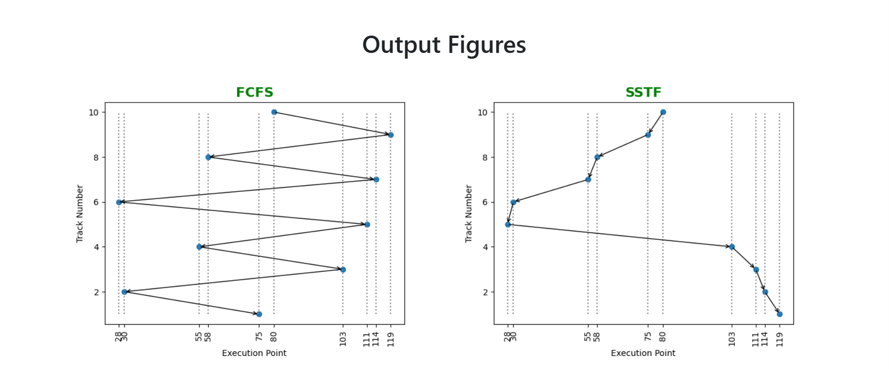
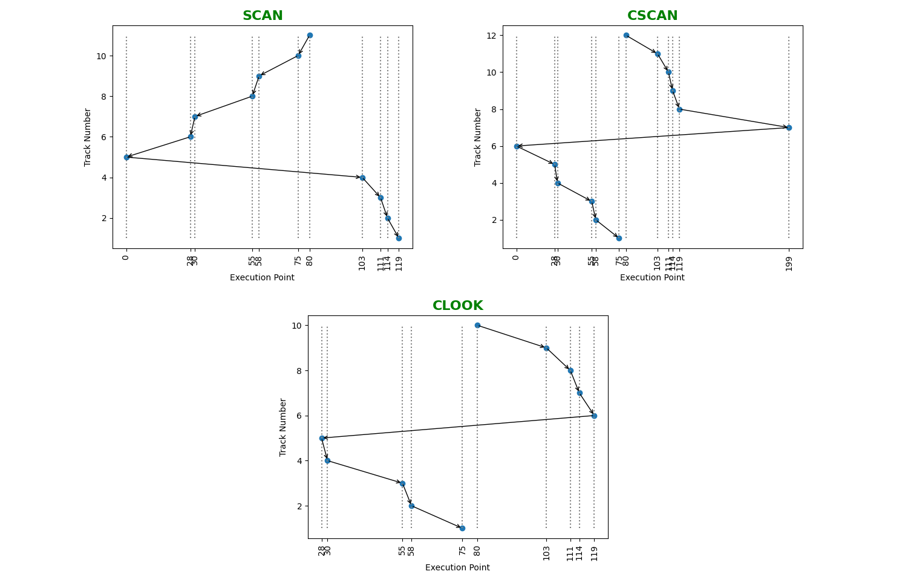

# Disk Scheduling Algorithm Simulation App :floppy_disk:

## Description 📝
Welcome to our Disk Scheduling Algorithm Simulation App! This app allows you to simulate disk head movement using various scheduling algorithms, including FCFS, SSTF, SCAN, CSCAN, and CLOOK. You can input the disk head position queue, initial head position, start and end positions to visualize the head movement array and graph for each algorithm.

## Technologies Used 💻

- Python 🐍
- Django 🚀
- Bootstrap 🎨

## The Team 👥
This app was created by a group of friends with a passion for algorithms and programming:

- [Banula Lakwindu](https://github.com/banulalakwindu) 👨‍💻
- [Lahiru Randima](https://github.com/WIJETHUNGA-174) 👨‍💻
- [Mihiri Elapatha](https://github.com/MIHIRI099) 👩‍💻

Feel free to check out their profiles for more awesome projects!

## How to Use 🔧
1. Clone the repository: `https://github.com/banulalakwindu/Disk-Scheduling-Algorithams-Performance-Analyzer.git`
2. Install the required dependencies: `pip install`
3. Run the Django development server: `python manage.py runserver`
4. Access the app in your web browser at `http://localhost:8000/`

## Screenshots 📸
Here are some screenshots of our app in action:

## Contributing 👋
We welcome contributions from the community! If you find any issues or want to add new features, please submit a pull request.

## License 📃
This project is licensed under the Apache License - see the [LICENSE](LICENSE) file for details.

---

Thank you for checking out our Disk Scheduling Algorithm Simulation App! If you have any questions or suggestions, feel free to open an issue or contact any of the team members. Happy coding! 🚀
